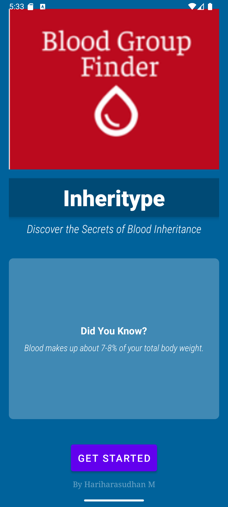
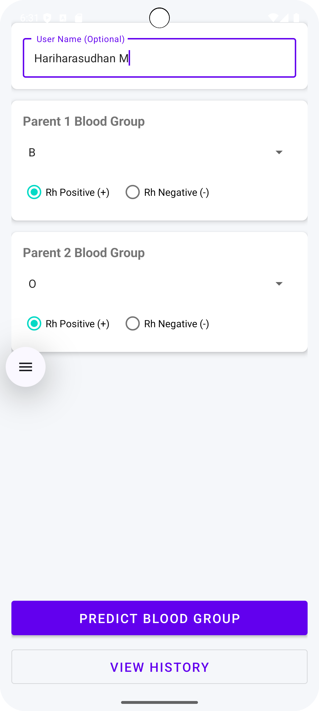
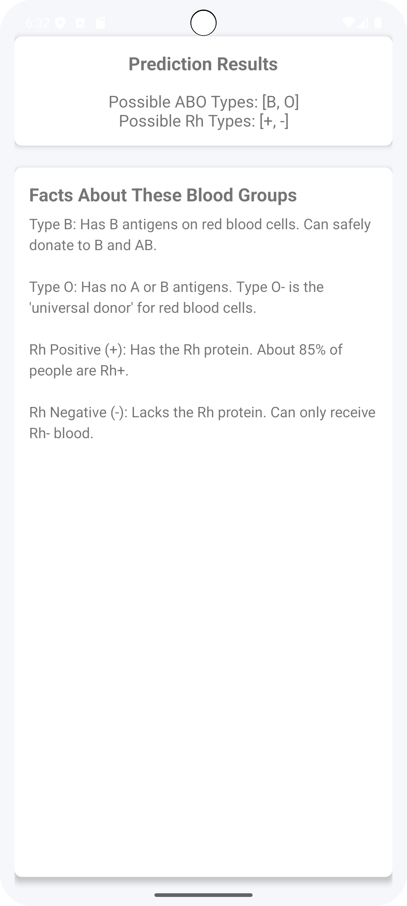
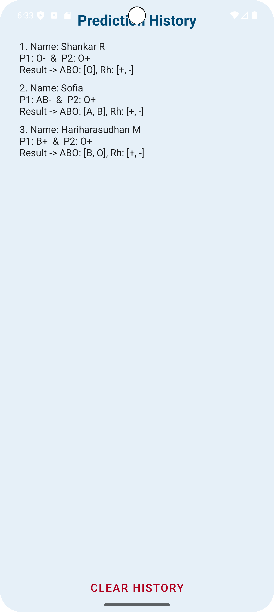

# Inheritype 🩸
A simple Android application for predicting possible blood group inheritance based on parental blood types.

## 📋 About The Project

**Inheritype** is an Android app built with Java that provides a simple, user-friendly interface to:
* Predict the possible ABO and Rh blood types of a child.
* Get a list of interesting facts related to the predicted blood groups.
* Save all predictions to a local database to view later in a history log.

This project was built as a way to learn Android development, including UI design with Material Components, local database management with SQLite, and multi-activity app architecture.

## ✨ Features

* **Blood Group Prediction:** Select the ABO/Rh types for two parents and get an instant list of possible child blood types.
* **Optional Naming:** Add a name to your prediction to easily identify it later.
* **Prediction History:** A numbered list of all past predictions, which can be cleared at any time.
* **Fact of the Day:** The home screen shows a random, interesting fact about blood types.
* **Blood Group Facts:** The results page shows relevant facts about the predicted blood groups.
* **Clean UI:** A modern, trust-inspiring blue color scheme built with Material Design.

## 📱 App Screenshots

| Home Screen | Input Form | Results Page | History Page |
| :---: | :---: | :---: | :---: |
|  |  |  |  |

*(To add screenshots, take pictures from your emulator, drag them into your project's folder, and change the `placeholder.png` names to match your file names.)*

## 🛠️ Built With

* **[Java](https://www.java.com/en/)**
* **[Android SDK](https://developer.android.com/sdk)**
* **[SQLite](https://www.sqlite.org/index.html)** - For the local prediction history database.
* **[Material Design Components](https://material.io/develop/android)** - For all UI elements like cards, buttons, and text fields.

## 🚀 How To Use

1.  Open the app to the **Inheritype** splash screen.
2.  Click **"Get Started"**.
3.  On the input form, optionally enter a name (e.g., "Hari").
4.  Use the dropdowns (Spinners) to select the **ABO Type (A, B, AB, O)** for both parents.
5.  Use the radio buttons to select the **Rh Factor (+ or -)** for both parents.
6.  Click **"Predict Blood Group"**.
7.  The app will save the prediction and show you the results page.
8.  From the input form, you can also click **"View History"** to see all past entries.

## 👨‍💻 Author

* **Hariharasudhan M**
